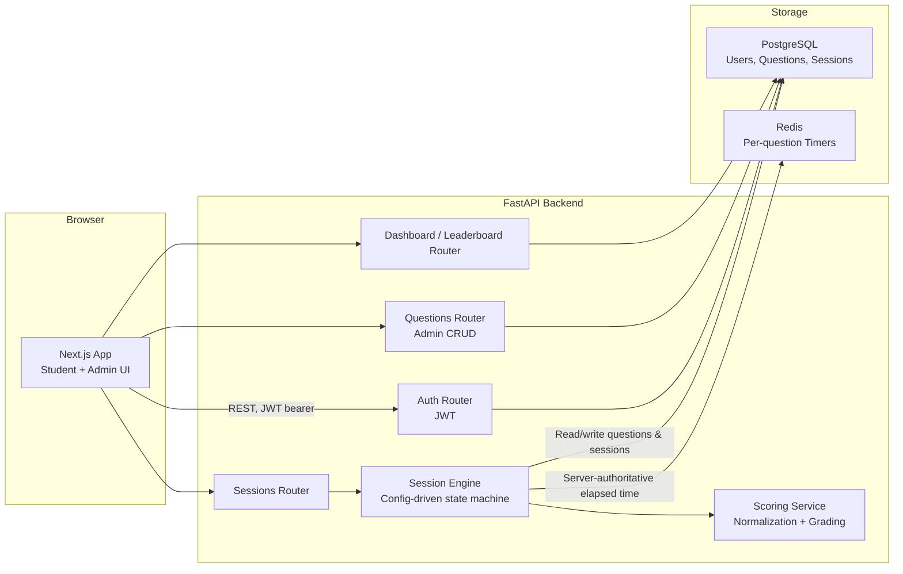
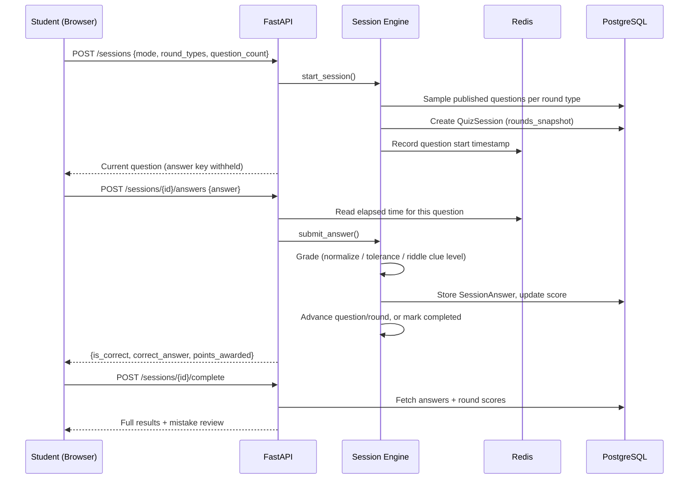
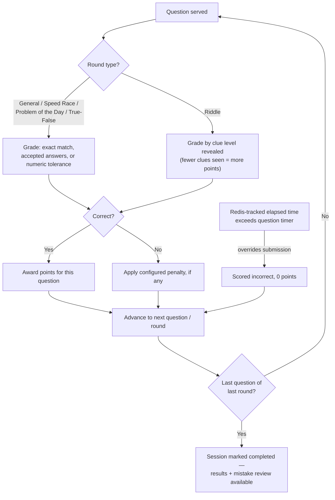

<p align="center">
  
</p>

# NSMQ MasterQuiz

**NSMQ MasterQuiz** is a gamified STEM competition-prep platform for Archbishop Porter Girls' Senior High School, built to prepare students for Ghana's National Science & Maths Quiz. It replaces manual grading and ad-hoc practice with a config-driven contest engine: timed rounds, server-side scoring, an admin-managed question bank, and per-student progress analytics.

> Not affiliated with NSMQ, Primetime Limited, or the Ghana Education Service. Round formats are modeled on publicly described contest structure; exact official rules are not guaranteed.

---

## Overview

Students practice against the real NSMQ round structure instead of a generic quiz bank:

* General Questions, Speed Race, Problem of the Day, True/False, and progressive-clue Riddles
* Four practice modes — Full Contest Simulation, Round Practice, Subject Practice, Quick Drill
* Every answer is scored server-side the instant it's submitted, with per-question timers enforced server-side (not just cosmetic countdowns)
* Admins manage the question bank — create, edit, publish/unpublish — without touching code

---

## Architecture

### System architecture



### Quiz session flow



### Round grading flow



---

## Features

* JWT auth for two roles — student and admin
* Admin-managed question bank across all 5 NSMQ round types, with create/edit/publish/unpublish
* Config-driven quiz engine — round rules (timer, points, penalty) live on each question, not hardcoded per round type
* Server-authoritative per-question timers via Redis — client-reported time is never trusted alone
* Answer normalization (case/whitespace-insensitive) and numeric-tolerance grading
* Progressive-clue Riddle round with decreasing point values per clue revealed
* Four practice modes: Full Contest Simulation, Round Practice, Subject Practice, Quick Drill
* Session history, dashboard analytics (accuracy by subject/round type, streaks), and mistake review
* Leaderboard ranked by best completed-session score
* Dockerized local dev — Postgres, Redis, backend, and frontend with one command
* CI on every push (backend pytest, frontend lint + build)
* Deploy configs for Vercel (frontend) and Render (backend + Postgres + Redis)

---

## Tech stack

| Layer            | Technologies                                 |
| ---------------- | --------------------------------------------- |
| Frontend         | Next.js (App Router), TypeScript, Tailwind CSS |
| Backend          | FastAPI, SQLAlchemy, Alembic                  |
| Database         | PostgreSQL                                    |
| Cache / timers   | Redis                                         |
| Auth             | JWT (python-jose), passlib/bcrypt             |
| Testing          | pytest (backend), ESLint + `next build` (frontend) |
| Infrastructure   | Docker, Docker Compose                        |
| CI/CD            | GitHub Actions, Vercel, Render                |

---

## Project structure

```txt
nsmq-masterquiz/
├── frontend/           # Next.js app (student + admin UI)
│   ├── app/            # Routes: landing, auth, student, admin, leaderboard
│   ├── components/     # Timer, QuestionCard, admin QuestionForm, etc.
│   └── lib/            # API client, auth context, shared types
├── backend/            # FastAPI app
│   ├── app/
│   │   ├── models.py       # SQLAlchemy models
│   │   ├── schemas.py      # Pydantic request/response schemas
│   │   ├── routers/        # auth, subjects, questions, sessions, dashboard, leaderboards
│   │   └── services/       # scoring.py, session_engine.py (the quiz state machine)
│   ├── alembic/         # DB migrations
│   ├── scripts/seed.py  # Sample question bank + demo admin account
│   └── tests/           # pytest suite
├── docker-compose.yml   # Postgres + Redis + backend + frontend, local dev
├── render.yaml          # Render Blueprint (backend + Postgres + Redis)
└── .github/workflows/ci.yml
```

---

## Core API routes

| Method | Route                          | Purpose                                  |
| ------ | ------------------------------- | ----------------------------------------- |
| POST   | `/auth/register`               | Create an account, returns a JWT          |
| POST   | `/auth/login`                  | Log in, returns a JWT                     |
| GET    | `/auth/me`                     | Current user profile                      |
| GET    | `/subjects`                    | List subjects                             |
| GET/POST | `/questions`                 | List / create questions (admin)           |
| PATCH/DELETE | `/questions/{id}`          | Edit / delete a question (admin)          |
| POST   | `/sessions`                    | Start a quiz session from a mode/config   |
| GET    | `/sessions/{id}`               | Current session state + active question   |
| POST   | `/sessions/{id}/answers`       | Submit an answer, get graded instantly    |
| POST   | `/sessions/{id}/reveal-clue`   | Reveal the next Riddle clue               |
| POST   | `/sessions/{id}/complete`      | Final results + mistake review            |
| GET    | `/me/dashboard`                | Accuracy, streaks, subject/round strength |
| GET    | `/me/history`                  | Past session list                         |
| GET    | `/leaderboards`                | Top scores across students                |

Full interactive docs at `/docs` once the backend is running (FastAPI's built-in Swagger UI).

---

## Example: starting a session

```json
POST /sessions
{
  "mode": "full_contest",
  "round_types": ["general", "speed_race", "problem_of_the_day", "true_false", "riddle"],
  "question_count": 10
}
```

```json
// Response
{
  "session_id": 1,
  "status": "in_progress",
  "round_index": 0,
  "round_type": "general",
  "question_index": 0,
  "question_count_in_round": 2,
  "total_score": 0,
  "current_question": {
    "question_id": 5,
    "round_type": "general",
    "question_type": "numeric",
    "subject": "Mathematics",
    "difficulty": "easy",
    "prompt": "If 2x + 5 = 15, what is the value of x?",
    "timer_seconds": 45,
    "points": 10,
    "revealed_clues": []
  }
}
```

---

## Local development

Requires Docker.

```bash
cp backend/.env.example backend/.env
cp frontend/.env.example frontend/.env

docker compose up -d
docker compose exec backend python -m scripts.seed   # sample questions + demo admin login
```

* Frontend: `http://localhost:3000` (adjust the mapped port in `docker-compose.yml` if it's taken locally)
* Backend + interactive docs: `http://localhost:8000/docs`

Run the backend test suite:

```bash
docker compose exec backend pytest -q
```

---

## Student & admin capabilities

**Students** get:

* Mode selection (Full Contest, Round Practice, Subject Practice, Quick Drill)
* A live timed quiz UI per round type, including progressive Riddle clue reveal
* Instant scoring and a post-session mistake review (prompt, your answer, correct answer, explanation)
* A dashboard: accuracy by subject and round type, current streak, best score
* A leaderboard across all students

**Admins** get:

* Full question bank CRUD, including Riddle clue authoring
* Publish/unpublish control over which questions students can be served
* A lightweight coordinator dashboard (question counts, top students)

---

## Deployment

See [DEPLOYMENT.md](DEPLOYMENT.md) — frontend on Vercel, backend + Postgres + Redis on Render via the `render.yaml` Blueprint.

---

## Roadmap / possible extensions

* Achievements/badges (data model exists; earn/display logic not yet built)
* Partial credit for Problem of the Day (multi-step problems)
* Coach accounts and assigned practice sets
* Virtual opponents / simulated pacing against a "ghost" contestant
* Real-time multiplayer, school-vs-school contests
